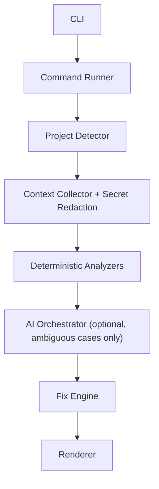

# SIFT

**Make a failed command understandable in seconds.**

SIFT sits between you and a failed command. It runs the command, diagnoses
the failure with fast local checks, falls back to an AI reasoning layer only
when it has to, and proposes — never silently applies — the smallest safe
fix.

[](https://github.com/your-username/sift/actions/workflows/ci.yml)
[](https://www.npmjs.com/package/sift-cli)
[](LICENSE)
[](package.json)

```
$ sift npm test
FAIL src/users.test.ts
  Cannot find module '@/modules/users' from 'src/users.test.ts'

✗ npm test (exit code 1, 3.2s)

WHY IT FAILED
Jest cannot resolve the @/* import alias. tsconfig.json defines it for
TypeScript, but Jest's own module resolver doesn't read tsconfig paths.

EVIDENCE
 ✓ tsconfig.json defines @/* → src/*
 ✓ failing import uses @/modules/users
 ✗ jest.config.js has no matching moduleNameMapper

LIKELY FIX
Add a moduleNameMapper entry for the alias:
 moduleNameMapper: {
   "^@\/(.*)$": "<rootDir>/src/$1"
 }

Confidence: 96%
```

## Table of contents

- [Why SIFT](#why-sift)
- [Install](#install)
- [Usage](#usage)
- [How it works](#how-it-works)
- [What SIFT can diagnose](#what-sift-can-diagnose)
- [AI-assisted fallback](#ai-assisted-fallback)
- [Applying fixes with `--fix`](#applying-fixes-with---fix)
- [Configuration](#configuration)
- [Privacy](#privacy)
- [CLI reference](#cli-reference)
- [Development](#development)
- [Roadmap](#roadmap)
- [Contributing](#contributing)
- [License](#license)

## Why SIFT

Most failed commands print everything *except* the answer: a wall of stack
trace, a cryptic exit code, a stderr line that assumes you already know the
codebase. SIFT's philosophy, in order:

1. **Diagnose locally and deterministically whenever possible.** No network
   call, no API key, no waiting — just fast, evidence-backed checks.
2. **Use AI as a reasoning layer, not the source of truth.** Only for the
   cases deterministic checks can't confidently explain, and always
   labeled, with facts kept separate from hypotheses.
3. **Never silently modify files.** Every fix is shown as a diff and
   requires your explicit approval before anything is written.
4. **Remain useful without AI.** Redact secrets and minimize context by
   default. SIFT is not an autonomous agent — it explains, it doesn't act
   on its own.

## Install

Once published to npm:

```bash
npm install -g sift-cli
```

From source:

```bash
git clone https://github.com/your-username/sift.git
cd sift
npm install
npm run build
npm link          # makes `sift` available globally
```

Requires Node.js 18 or later.

## Usage

```bash
sift <command...>
```

```bash
sift npm test
sift npm run build
sift pytest
sift docker compose up
```

SIFT streams the wrapped command's own output live, exactly as it would
print normally, then adds its diagnosis underneath. It exits with the same
exit code as the command it ran, so it's safe to drop into scripts and CI:

```bash
sift npm test && echo "ok"
```

## How it works



Deterministic analyzers always run first and are the primary source of
truth. The AI reasoning layer only gets involved when nothing deterministic
produced a confident diagnosis — and even then, it only ever sees a small,
redacted, explicitly-built payload (see [Privacy](#privacy)), never your
whole repository.

## What SIFT can diagnose

Eight deterministic analyzers ship today, each producing evidence-backed
findings with a confidence score:

| Analyzer | Catches |
|---|---|
| **Missing dependency** | A package is imported but not installed, or not declared at all |
| **TypeScript/Jest path-alias mismatch** | `tsconfig.json` defines a `@/*`-style alias Jest's resolver doesn't know about |
| **Missing environment variable** | Output reports a required env var that isn't set or declared |
| **Node version mismatch** | The running Node version doesn't satisfy `package.json`'s `engines.node` |
| **Port already in use** | `EADDRINUSE`, with a best-effort, read-only lookup of what's holding the port |
| **TypeScript config conflict** | A broken `extends` path, or a known `tsc` config error code |
| **Lockfile / package-manager mismatch** | Multiple lockfiles present, or the wrong package manager was invoked |
| **Docker/container issues** | Daemon not running, port already allocated, missing network, image pull denied, disk full |

Every analyzer is independent — one throwing an error never takes down the
rest of a diagnostic run.

## AI-assisted fallback

If no deterministic analyzer produces a confident diagnosis (below a 70%
confidence threshold, including "no finding at all") and an API key is
available, SIFT asks an AI reasoning layer to explain the failure. That
explanation always appears in its own clearly labeled section:

```
AI-ASSISTED EXPLANATION (via anthropic:claude-3-5-sonnet-latest, unverified)
...

Evidence:
 - facts drawn directly from the supplied context

Assumptions (not directly confirmed):
 - things the model inferred but that aren't confirmed

Confidence: 55% (AI estimate, not verified by execution)
```

Facts and hypotheses are never blurred together, and SIFT never claims a
fix works without actually re-running the command. Without an API key set,
SIFT works exactly the same for everything deterministic analyzers can
catch — it just skips the AI fallback for the remaining ambiguous cases,
with a one-line note saying so and how to enable it.

Use `--no-ai` to skip this fallback entirely.

## Applying fixes with `--fix`

Add `--fix` to have SIFT offer to fix the top finding automatically, when
it's confident enough to compute the *exact* resulting file content (not
every finding qualifies — many are suggestions for a human to apply):

```
$ sift --fix npm test
... npm test's own output ...

✗ npm test (exit code 1, 3.2s)

WHY IT FAILED
...

Index: jest.config.js
===================================================================
--- jest.config.js	before
+++ jest.config.js	after
@@ -1,3 +1,6 @@
 module.exports = {
+  moduleNameMapper: {
+    "^@\/(.*)$": "<rootDir>/src/$1"
+  },
   testEnvironment: "node"
 };

Apply this fix? [y/N] y

Applied fix to jest.config.js.
Re-running: npm test
✓ npm test (1.8s)

✓ Fixed! The original failure no longer reproduces.
```

The fix flow always follows the same steps, in order, and never skips one:

1. **Validate** — re-reads the target file right before applying, and
   refuses if it's changed since the fix was proposed (a stale patch) or if
   a file expected to be created already exists.
2. **Show a diff** — a standard unified diff, always shown, even with
   `--yes` — you always see exactly what will change.
3. **Explicit confirmation** — SIFT prompts `[y/N]` and does nothing on
   anything other than `y`/`yes`. Use `--yes` to auto-confirm (e.g. in a
   script you already trust), or run non-interactively with plain `--fix`
   to always decline (a safe default for CI).
4. **Apply atomically** — writes to a temp file and renames it over the
   target, so a crash mid-write can never leave a half-written file.
5. **Rerun and verify** — reruns your *original* command and reports
   whether it actually resolved the failure.

SIFT never executes arbitrary commands an AI suggests, and never applies
anything without a diff and your explicit approval first.

## Configuration

You don't have to export an environment variable in every shell — SIFT can
store your API key locally:

```bash
sift config set api-key sk-ant-...
sift config set model claude-3-5-sonnet-latest   # optional

sift config get api-key            # masked by default
sift config get api-key --reveal   # shown in full
sift config list
sift config unset api-key
sift config path                   # prints the config file location
```

Settings are stored as plain JSON at `~/.sift/config.json`, written with
owner-only file permissions (`600`). This is a convenience, not a secrets
vault — treat it like any other local credential file: don't commit it,
don't share it.

| Variable | Purpose |
|---|---|
| `ANTHROPIC_API_KEY` | Enables the AI-assisted fallback. Optional. |
| `SIFT_AI_MODEL` | Overrides the default Anthropic model used. |

**Precedence:** the environment variables above, when set, always override
the stored config — so CI can inject a key without ever touching disk,
while your everyday shell can just rely on `sift config set` once.

## Privacy

- `.env` files are **never read for their values** — only variable *names*
  are collected, to check whether a required variable is declared.
- Anything sent to the AI provider (stdout/stderr, config file contents)
  passes through a redaction pass first, stripping things that look like
  API keys, tokens, passwords, private keys, and JWTs.
- Only a small, explicit set of files (`tsconfig.json`, Jest config, Docker
  files) are ever read — never your whole repository, never `node_modules`.
- SIFT never proposes or runs destructive commands, and never applies a
  file change without showing you the diff first.

## CLI reference

```
sift <command...>          Run a command and diagnose a failure
sift --help, -h            Show help
sift --version, -v         Show the installed version
sift --json <cmd...>       Machine-readable JSON output
sift --no-ai <cmd...>      Skip the AI-assisted fallback
sift --fix <cmd...>        Offer to apply the top fix (prompts for approval)
sift --fix --yes <cmd...>  Same, but auto-confirm instead of prompting
sift config ...            Manage stored settings (see Configuration)
```

## Development

```bash
npm install
npm run dev -- npm test    # run the CLI from source via tsx, no build step
npm test                   # run the test suite (vitest)
npm run build              # compile TypeScript to dist/
```

### Project layout

```
src/
  cli/        entry point (argument parsing, orchestration)
  runner/     the CommandRunner interface + Node child_process implementation
  render/     terminal output formatting
  detection/  ProjectDetector: finds the project root and its tooling
  context/    ContextCollector: bounded, privacy-aware file reading
  analyzers/  the 8 deterministic analyzers + orchestrator
  types/      shared data models (Finding, ProjectContext)
  ai/         AI reasoning layer: redaction, schemas, provider, orchestrator
  fixes/      Fix Engine: diff rendering, validation, atomic apply, rerun
  config/     local settings store (~/.sift/config.json)
tests/
  unit/            tests for individual modules
  unit/analyzers/  one test file per deterministic analyzer
  unit/ai/         redaction, schema, provider, and AI-orchestrator tests
  unit/fixes/      diff rendering and Fix Engine tests
  unit/config/     config store tests
  unit/cli/        config subcommand tests
  integration/     end-to-end tests that invoke the CLI as a subprocess
  fixtures/        small real broken projects used by the tests above
```

### Design notes

- **No opaque stack traces.** Failures are reported as a clean summary,
  never a raw Node.js exception — including command-not-found and signals.
- **Cross-platform.** Commands are spawned directly (no shell) on
  macOS/Linux for unambiguous exit-code/signal handling; a shell is used on
  Windows so `.cmd`-shimmed tools (npm, npx, yarn) resolve correctly.
- **Reusable interfaces.** `CommandRunner`, `Analyzer`, and `LLMProvider`
  are all small interfaces, so alternative implementations can be swapped
  in without touching the orchestration layer.
- **Fixes are validated and reversible.** Stale-patch detection, atomic
  writes (temp file + rename), and a rerun-to-verify step before SIFT ever
  says "fixed."
- **Conservative auto-patching.** Only findings where an analyzer can
  compute the *entire* resulting file content are auto-applicable with
  `--fix`. Everything else is a suggestion for you to apply by hand.

## Roadmap

- [x] **Phase 0** — CLI foundation & command runner
- [x] **Phase 1** — Deterministic diagnostics (8 analyzers)
- [x] **Phase 2** — AI orchestrator (redaction, provider abstraction, structured schema)
- [x] **Phase 3** — Fix Engine (diffs, explicit approval, atomic apply, rerun)
- [ ] **Phase 4** — Product polish: npm publishing, deeper cross-platform
      testing, `sift explain`/`sift check`/`sift doctor` secondary commands
- [ ] Post-MVP: GitHub Actions integration, IDE integrations, local-model
      support, failure fingerprints, Python/Go/Java/.NET support

## Contributing

Contributions are welcome — see [CONTRIBUTING.md](CONTRIBUTING.md) for how
to get set up, testing conventions, and how to add a new analyzer.

## License

[MIT](LICENSE)
